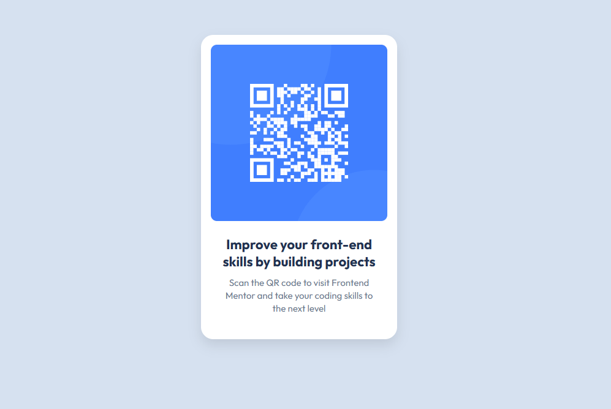

# Frontend Mentor - QR code component solution

This is a solution to the [QR code component challenge on Frontend Mentor](https://www.frontendmentor.io/challenges/qr-code-component-iux_sIO_H). Frontend Mentor challenges help you improve your coding skills by building realistic projects. 

## Table of contents

- [Overview](#overview)
  - [Screenshot](#screenshot)
  - [Links](#links)
- [My process](#my-process)
  - [Built with](#Tools-and-services-I-used)
  - [What I learned](#what-i-learned)
  - [Continued development](#continued-development)
- [Author](#author)

**Note: Delete this note and update the table of contents based on what sections you keep.**

## Overview

### Screenshot

### Links

- Solution URL: [click here](https://github.com/faisalalmail/qr-code-component)
- Live Site URL: [click here](https://qr-code-component-three-drab.vercel.app/)

## My process

### Tools and services I used

- VS Code
- Git
- Github
- Vercel (for deployment)

### What I learned

Coming from a background of basic HTML and CSS, doing a project using git to professionally track, control and deploy is a new expereince for me.

- 1- I also had my first expereince with Figma.
- 2- importing a specific font from google fonts.

### Continued development

I dont want to keep this part blank, but sure moving forward to the next frontendmentor challenge to learn more

## Author
My name is Faisal - A 35 year old guy from a small island in the middle of the world called Bahrain. I had the passion to code and practiced with html and PHP long ago. I stopped then, but the passion never died. and this could be my way to return.

- Instagram - [Faisal Almail](https://www.instagram.com/faisal.almail)
- Frontend Mentor - [@yourusername](https://www.frontendmentor.io/profile/faisalalmail)

